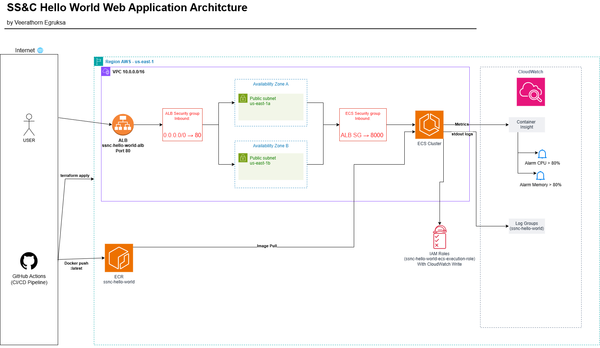

# SS&C Technical Exercise — Hello World on AWS ECS Fargate

> Deployed a containerised "Hello World" FastAPI web application on AWS ECS Fargate using Terraform, with a full CI/CD pipeline, health checks, and CloudWatch observability.

## Live Demo

| | URL |
|---|---|
| **Hello World UI** | http://ssnc-hello-world-alb-1578263140.us-east-1.elb.amazonaws.com |
| **Health Check** | http://ssnc-hello-world-alb-1578263140.us-east-1.elb.amazonaws.com/health |
| **Swagger Docs** | http://ssnc-hello-world-alb-1578263140.us-east-1.elb.amazonaws.com/docs |

---

## Architecture



> Full architecture diagram showing VPC, ALB, ECS Fargate, ECR, IAM, and CloudWatch across 2 Availability Zones in us-east-1.

### AWS Services Used

| Service | Purpose |
|---|---|
| **ECS Fargate** | Serverless container runtime — no EC2 to manage |
| **ECR** | Private Docker image registry |
| **ALB** | Internet-facing load balancer, routes HTTP traffic |
| **VPC + Subnets** | Isolated network across 2 availability zones |
| **CloudWatch Logs** | Container stdout/stderr logs |
| **CloudWatch Alarms** | CPU and memory threshold alerts |
| **IAM** | Least-privilege execution role for ECS |

---

## Project Structure

```
SSNC_Technical_Interview/
├── app/
│   ├── main.py              # FastAPI app — /, /echo, /health endpoints
│   ├── requirements.txt     # fastapi + uvicorn
│   └── Dockerfile           # python:3.12-slim, port 8000
├── terraform/
│   ├── main.tf              # Root module — wires everything together
│   ├── variables.tf
│   ├── outputs.tf
│   ├── versions.tf          # AWS provider, Terraform version
│   └── modules/
│       ├── networking/      # VPC, subnets, IGW, security groups
│       ├── ecr/             # ECR repo + lifecycle policy
│       ├── alb/             # ALB, target group, HTTP listener
│       ├── ecs/             # Fargate cluster, task def, IAM role, service
│       └── monitoring/      # CloudWatch log group + CPU/memory alarms
├── .github/
│   └── workflows/
│       └── deploy.yml       # CI/CD pipeline (3 jobs)
├── tests/
│   └── health_check.sh      # Integration test script
└── evidence/                # Screenshots from live AWS deployment
```

---

## Application

Built with **FastAPI (Python)** — lightweight, fast, and comes with auto-generated Swagger docs.

### Endpoints

| Method | Path | Description |
|---|---|---|
| `GET` | `/` | Interactive Hello World UI |
| `POST` | `/echo` | Accepts a message, returns a response, logs to CloudWatch |
| `GET` | `/health` | Health check — returns `{"status":"healthy"}` |
| `GET` | `/docs` | Auto-generated Swagger UI |

### Interactive Echo

Type one of the two supported inputs:

| Input | Response |
|---|---|
| `Hello World` | `Hello SS&C! 👋` |
| `Veerathorn` | `Hi! It's me Veerathorn, Nice to meet you! 🙌` |
| anything else | Prompt to use one of the two options |

Every submission is logged to **CloudWatch** with timestamp, IP, input, and reply.

---

## CI/CD Pipeline

**GitHub Actions** — triggers on every push to `main`.

```
Push to main
      │
      ▼
┌─────────────────────┐
│  Job 1: Terraform   │  terraform init → validate → plan → apply
│  Apply              │  Creates all AWS infrastructure
└──────────┬──────────┘
           │
           ▼
┌─────────────────────┐
│  Job 2: Build &     │  docker build → push to ECR
│  Push               │  aws ecs update-service --force-new-deployment
└──────────┬──────────┘
           │
           ▼
┌─────────────────────┐
│  Job 3: Integration │  health_check.sh hits live ALB /health
│  Health Check       │  Fails pipeline if not HTTP 200
└─────────────────────┘
```

---

## Infrastructure (Terraform)

All infrastructure is defined as code across 5 modules:

- **networking** — VPC (`10.0.0.0/16`), 2 public subnets across AZs, IGW, route tables, ALB + ECS security groups
- **ecr** — Private ECR repository with lifecycle policy (retains last 5 images)
- **alb** — Internet-facing ALB, target group with `/health` health check, HTTP listener
- **ecs** — Fargate cluster with Container Insights, IAM execution role, task definition, service with rolling deployment
- **monitoring** — CloudWatch log group (7-day retention), CPU > 80% alarm, Memory > 80% alarm

### Security design
- ECS tasks are only reachable **via the ALB** — ECS security group restricts inbound to ALB SG only
- No direct public access to containers
- IAM role follows **least privilege** — only ECR pull and CloudWatch write
- No secrets hardcoded — AWS credentials passed via GitHub Secrets


